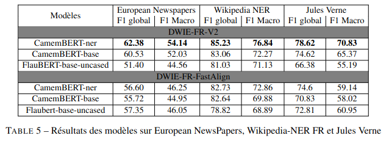

# Training a model from DWIE-FR dataset for Named Entity Recognition

## Download dataset from drive
To download our dataset, follow this link: <a>https://drive.google.com/drive/folders/1A4Q8B3VIo64Iz5pto4_3csk_5eTwZ09C?usp=share_link</a>


## Benchmark models from paper:



### Hyper-parameters used in these experiences:
* lr = 1e-5
* batch size = 16
* epoch = 50

## Training a model:

To train your model on a single level from ontology dwie-fr please use the script bellow.

```(bash)
    ./scripts/run_single_onto.sh
```

To train your model on the different levels from ontology dwie-fr please use the script bellow.

```(bash)
    ./scripts/run_onto_dwie.sh
```

## Evaluate your model trained on DWIE-FR dataset

